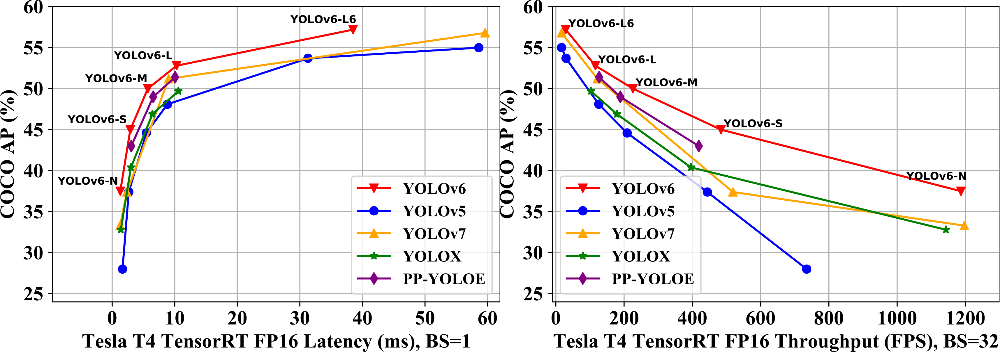

<div align="center">
<h2>
  Yolov6-Pip: Packaged version of the Yolov6 repository  
</h2>
<h4>
    
</h4>
<div>
    <a href="https://pepy.tech/project/yolov6detect"></a>
    <a href="https://badge.fury.io/py/yolov6detect"></a>
    <a href="https://huggingface.co/spaces/kadirnar/yolov6"></a>
</div>
</div>

## <div align="center">Overview</div>

This repo is a packaged version of the [Yolov6](https://github.com/meituan/YOLOv6/) model.
## Benchmark
| Model                                                        | Size | mAP<sup>val<br/>0.5:0.95 | Speed<sup>T4<br/>trt fp16 b1 <br/>(fps) | Speed<sup>T4<br/>trt fp16 b32 <br/>(fps) | Params<br/><sup> (M) | FLOPs<br/><sup> (G) |
| :----------------------------------------------------------- | ---- | :----------------------- | --------------------------------------- | ---------------------------------------- | -------------------- | ------------------- |
| [**YOLOv6-N**](https://github.com/meituan/YOLOv6/releases/download/0.3.0/yolov6n.pt) | 640  | 37.5                     | 779                                     | 1187                                     | 4.7                  | 11.4                |
| [**YOLOv6-S**](https://github.com/meituan/YOLOv6/releases/download/0.3.0/yolov6s.pt) | 640  | 45.0                     | 339                                     | 484                                      | 18.5                 | 45.3                |
| [**YOLOv6-M**](https://github.com/meituan/YOLOv6/releases/download/0.3.0/yolov6m.pt) | 640  | 50.0                     | 175                                     | 226                                      | 34.9                 | 85.8                |
| [**YOLOv6-L**](https://github.com/meituan/YOLOv6/releases/download/0.3.0/yolov6l.pt) | 640  | 52.8                     | 98                                      | 116                                      | 59.6                 | 150.7               |
|                              |                               |                                |                    |                        |
| [**YOLOv6-N6**](https://github.com/meituan/YOLOv6/releases/download/0.3.0/yolov6n6.pt) | 1280 | 44.9                     | 228                                     | 281                                      | 10.4                 | 49.8                |
| [**YOLOv6-S6**](https://github.com/meituan/YOLOv6/releases/download/0.3.0/yolov6s6.pt) | 1280 | 50.3                     | 98                                      | 108                                      | 41.4                 | 198.0               |
| [**YOLOv6-M6**](https://github.com/meituan/YOLOv6/releases/download/0.3.0/yolov6m6.pt) | 1280 | 55.2                     | 47                                      | 55                                       | 79.6                 | 379.5               |
| [**YOLOv6-L6**](https://github.com/meituan/YOLOv6/releases/download/0.3.0/yolov6l6.pt) | 1280 | 57.2                     | 26                                      | 29                                       | 140.4                | 673.4               |
### Installation
```
pip install yolov6detect
```

### Yolov6 Inference
```python
from yolov6 import YOLOV6

model = YOLOV6(weights='yolov6s.pt', device='cuda:0') 
#model = YOLOV6(weights='kadirnar/yolov6t-v2.0', device='cuda:0', hf_model=True)

model.classes = None
model.conf = 0.25
model.iou_ = 0.45
model.show = False
model.save = True

pred = model.predict(source='data/images',yaml='data/coco.yaml', img_size=640)
```
### Citation
```bibtex
@article{li2022yolov6,
  title={YOLOv6: A single-stage object detection framework for industrial applications},
  author={Li, Chuyi and Li, Lulu and Jiang, Hongliang and Weng, Kaiheng and Geng, Yifei and Li, Liang and Ke, Zaidan and Li, Qingyuan and Cheng, Meng and Nie, Weiqiang and others},
  journal={arXiv preprint arXiv:2209.02976},
  year={2022}
}
```
