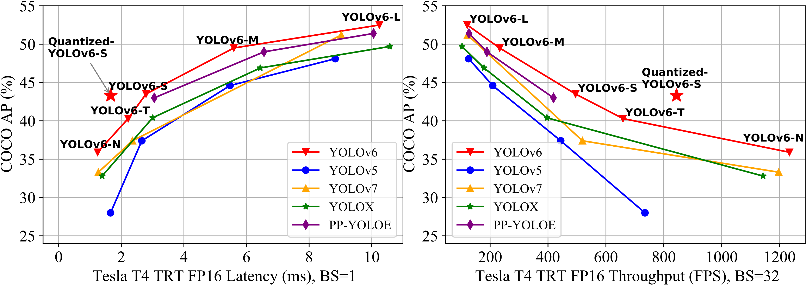

<div align="center">
<h2>
  Yolov6-Pip: Packaged version of the Yolov6 repository  
</h2>
<h4>
    
</h4>
</div>

## <div align="center">Overview</div>

This repo is a packaged version of the [Yolov6](https://github.com/meituan/YOLOv6/) model.
### Installation
```
pip install yolov6detect
```

### Yolov6 Inference
```python
from yolov6 import YOLOV6

model = YOLOV6(weights='yolov6s.pt', device='cuda:0') 
#model = YOLOV6(weights='kadirnar/yolov6t-v2.0', device='cuda:0', hf_model=True)

model.classes = None
model.conf = 0.25
model.iou_ = 0.45
model.show = False
model.save = True

pred = model.predict(source='data/images',yaml='data/coco.yaml', img_size=640)
```
### Citation
```bibtex
@article{li2022yolov6,
  title={YOLOv6: A single-stage object detection framework for industrial applications},
  author={Li, Chuyi and Li, Lulu and Jiang, Hongliang and Weng, Kaiheng and Geng, Yifei and Li, Liang and Ke, Zaidan and Li, Qingyuan and Cheng, Meng and Nie, Weiqiang and others},
  journal={arXiv preprint arXiv:2209.02976},
  year={2022}
}
```